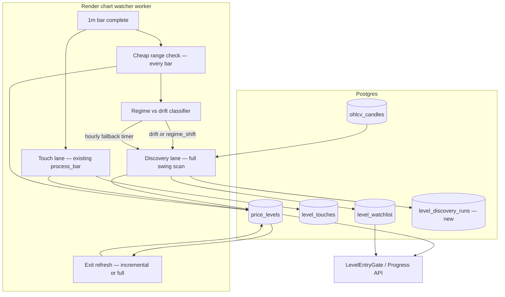

# Rolling Swing Discovery — Implementation Plan

**Status:** Plan only (no implementation yet)  
**Goal:** Discover and refresh price levels in **near real time** from a sliding bar window, so `level_watchlist` and the entry gate stay aligned with where the market trades **now** — not only levels from a one-time historical seed.

For a fast-moving day-trading system, discovery must not wait on a fixed daily clock. A symbol that breaks into new territory at 9:00 should get new levels within **minutes**, not up to 24 hours later.

---

## Problem

Today the system has two separate concerns that are only partially connected:

| Lane | What it does today | Gap |
|------|-------------------|-----|
| **Discovery** | Mostly `scripts/seed_level_intelligence.py` (full-history batch) | Levels go stale after large moves (e.g. MES levels ~7294 vs price ~7600) |
| **Touch tracking** | `LevelIntelligenceSystem.process_bar()` in the watcher | Updates hold/break stats on known levels; only weakly creates new levels on touch |
| **Exit optimization** | `scripts/compute_exit_optimizer.py` (batch) | Gate requires TP/SL/EV fields that live touch tracking does not refresh |

The watcher is **touch-driven**, not **discovery-driven**. Rolling swing discovery closes that gap.

---

## Definitions

- **Rolling window** — how much history each discovery pass considers (e.g. last **60 calendar days** of 1m bars). Old structure outside the window can be retired.
- **Discovery trigger** — *when* a full discovery pass runs. **Primary (v1): event-driven on every bar.** **Secondary: hourly safety net.**
- **Merge policy** — how newly discovered clusters update `price_levels` without wiping live touch history.
- **Regime shift** — price has moved so far from the existing level set that incremental merge + a few deactivations is insufficient; the symbol needs **wholesale re-discovery** across the new trading range (typical after 20–40% moves on BTC, SOLUSD, ES, or multi-session gaps on MES).
- **Drift deactivation** — a **small number** of levels aged out of relevance (e.g. >3% from last close, no touches in window) while price still trades near the bulk of the level book. Low blast radius; selective `is_active = FALSE`.

**Stale cutoff (3%) applies to drift only.** It must be paired with regime-shift detection — not used alone to “clean up” after a large gap.

### Discovery scheduling (revised)

| Mode | When | Cost | Purpose |
|------|------|------|---------|
| **Event trigger (primary)** | Every completed 1m bar, after a cheap range check | One indexed `MIN/MAX` query per symbol per bar (~ms) | Run full discovery when **current close is outside the existing `price_levels` envelope** for that symbol — the exact MES failure mode (price ~7600, levels capped ~7294) |
| **Interval fallback (secondary)** | At most once per `LEVEL_DISCOVERY_INTERVAL_SEC` (default **3600** = hourly) per symbol | Full swing scan | Catch drift when price stays *inside* stale levels but those levels are no longer meaningful; backup if event logic misfires |
| **Manual / cron** | `run_rolling_discovery.py` | Full scan | Bootstrap, backfill, ops |

**Do not use daily (86400s) as the default.** That barely improves on today’s one-shot seed for intraday regime breaks.

With **22 symbols**, hourly fallback, and event triggers, discovery overlap is **expected** (e.g. ES still running when the next interval fires, or a second `range_escape` while a regime pass is mid-flight). Single-flight behavior must be specified — not left implicit.

#### Event trigger — cheap check every bar

On each 1m bar (in the watcher, before enqueueing a heavy discovery job):

```sql
SELECT MIN(level_price), MAX(level_price)
FROM price_levels
WHERE symbol = %s;
```

Compare bar close to `[min, max]` with a small buffer (e.g. `cluster_pct` or `LEVEL_DISCOVERY_RANGE_BUFFER_PCT`):

- If `close < min * (1 - buffer)` or `close > max * (1 + buffer)` → classify **regime vs minor escape** (see below), then enqueue discovery.
- If no rows exist → enqueue immediately (cold symbol).
- Otherwise → skip; touch lane continues as today.

This directly targets stale level sets without running a full swing scan on every bar.

#### Regime shift vs minor range escape

When the envelope check fires, compute **gap severity** before choosing merge strategy:

| Metric | Formula (example) | Use |
|--------|-------------------|-----|
| **Upside gap** | `(close - envelope_max) / envelope_max` | Close above old high |
| **Downside gap** | `(envelope_min - close) / envelope_min` | Close below old low |
| **Gap pct** | `max(upside, downside, 0)` | Single severity score |

**Classification (defaults):**

| Case | Condition | Work profile | Risk |
|------|-----------|--------------|------|
| **Minor escape** | Gap pct > buffer but `< LEVEL_DISCOVERY_REGIME_GAP_PCT` (default **8%**) | Incremental merge: add clusters in new zone, **drift-deactivate** outliers (>3% from close, no window touches) | Low — preserves most touch history |
| **Regime shift** | Gap pct `>= LEVEL_DISCOVERY_REGIME_GAP_PCT` **OR** >50% of active watchlist levels are >3% from close with zero window touches | **Wholesale re-discovery**: full swing scan on rolling window, bulk deactivate all levels outside new `[discovered_min, discovered_max]` band, merge fresh clusters across entire new range, **full-symbol exit recompute** | High — many rows change; gate may briefly have fewer actionable levels until exit optimizer catches up |

Examples:

- **MES ~4% above envelope** (7294 → 7600): minor escape path — incremental merge + selective deactivation.
- **BTC/SOL/ES 20–40% move**: regime shift — do **not** rely on 3% drift deactivation alone; deactivate the old book in bulk and populate levels across the new range.

The event trigger and merge path share one detection step: `classify_discovery_mode(symbol, close, envelope) -> 'drift' | 'regime_shift'`.

Recommended defaults for v1:

| Setting | Default | Notes |
|---------|---------|-------|
| Window | 60 days | Tunable per asset class |
| **Primary trigger** | **Price outside `price_levels` range** | Cheap check every bar |
| **Fallback interval** | **3600s (hourly)** | Not daily |
| **Post-trigger cooldown** | **300s (5 min)** | Applies **after** a completed run; does not block coalesced pending reruns (see concurrency) |
| Bar source | `ohlcv_candles` 1m, resample to 5m for swings | Matches seed + exit optimizer |
| **Drift deactivation** | Level > **3%** from last close AND no touch in window | **Drift path only** — selective retire |
| **Regime gap threshold** | **8%** envelope escape (`LEVEL_DISCOVERY_REGIME_GAP_PCT`) | Switches to wholesale re-discovery |
| Min touches to stay active | 5 | Align with gate / watchlist thresholds |

---

## Target architecture



**Three lanes, one database:**

1. **Touch lane (keep)** — On each bar: detect touches, resolve outcomes, increment stats, `_refresh_watchlist_entry`.
2. **Discovery lane (new)** — **Event-triggered** when price escapes the current `price_levels` range; **hourly fallback** per symbol. Classifies **drift vs regime shift**, then runs the appropriate merge path. Runs **async** (never block the bar pipeline).
3. **Exit refresh (extend)** — **Incremental** after drift merge; **full-symbol** after regime shift (all newly active levels need TP/SL/EV before gate-ready).

---

## Concurrency — single-flight per symbol (specified)

Discovery runs **async** in the worker. Each symbol has its own lock — **22 symbols may discover in parallel**, subject to a global cap (below). Overlap is handled **per symbol** as follows.

### Per-symbol state

```text
idle ──enqueue──► running ──finish──► idle
                      ▲                  │
                      │                  │ pending set?
                      └── coalesced ─────┘
                          rerun (once)
```

| State field | Purpose |
|-------------|---------|
| `_running: bool` | True while `run_discovery()` is in flight for this symbol |
| `_pending: bool` | At most **one** follow-up run requested while `_running` |
| `_pending_request` | Latest `{trigger, mode, close, enqueued_at}` to use for the coalesced rerun |
| `_last_completed_at` | For cooldown + interval fallback |

### Overlap policy (v1 — explicit)

When `enqueue_discovery(symbol, request)` is called while a run for that symbol is **already running**:

| Option | v1 decision | Rationale |
|--------|-------------|-----------|
| **Silently skip** | ❌ Not alone | Interval or second `range_escape` is lost; stale data persists until next trigger |
| **Unbounded queue** | ❌ Rejected | 22 symbols × volatile events → backlog, memory growth, stale queued closes |
| **Kill-and-restart** | ❌ Rejected | Partial DB merge + exit recompute; hard to reason about; wastes in-progress work |
| **Coalesce one pending rerun** | ✅ **Default** | Set `_pending = True`; merge into `_pending_request` using priority rules below; when current run **finishes successfully or with error**, if `_pending` then start **exactly one** more run and clear `_pending` |

**Logging:** Do not write a full `level_discovery_runs` row for coalesced skips. Increment an in-memory `coalesced_count` (expose in watcher status / optional audit column `runs_coalesced` on the *completed* run that fulfilled the pending work).

### Pending request priority (merge while running)

When multiple triggers arrive during one run, keep the **highest-priority** pending request (not FIFO):

1. `merge_mode = regime_shift` over `drift` (use more severe mode).
2. `trigger = range_escape` over `interval` over `startup`.
3. Latest `close` wins for mode re-classification if trigger ties.

Example: ES interval fires at :00 while a drift `range_escape` run started at :58 — **do not** start a second task; set pending. If price keeps breaking out and pending upgrades to `regime_shift`, the coalesced rerun uses regime merge.

Example: ES run still going at :00 when hourly interval fires — **coalesce** into pending (interval preserved if no higher-priority event arrived); one follow-up run after current finishes.

### Cooldown interaction

- **Cooldown applies after a completed run**, before accepting a **new** enqueue from the bar loop (prevents 1m bar spam).
- **Coalesced pending reruns bypass cooldown** — they represent deferred work, not duplicate spam.
- If run completes, pending is false, and cooldown active → skip new `range_escape` enqueues until cooldown expires; **interval** may still set pending only if not in cooldown (interval is lower priority anyway).

### Cross-symbol pool cap

22 concurrent full scans can saturate Postgres on Render.

| Setting | Default | Behavior |
|---------|---------|----------|
| `LEVEL_DISCOVERY_MAX_CONCURRENT` | `4` | Global semaphore; `enqueue_discovery` waits (async) or defers start until slot free — **per-symbol pending still coalesces**, does not create 2 tasks |

Symbols are independent: ES pending does not block MES unless the global pool is full (then ES’s coalesced start waits for a slot — acceptable).

### Scheduler API (explicit)

```python
# chart_watcher/level_discovery_scheduler.py

@dataclass(frozen=True)
class DiscoveryRequest:
    symbol: str
    trigger: str       # range_escape | interval | manual | startup
    mode: str          # drift | regime_shift
    close: float
    enqueued_at: float  # monotonic

def enqueue_discovery(request: DiscoveryRequest) -> EnqueueResult:
    """
    Returns:
      started     — this call started a new async task
      coalesced   — run in flight; merged into pending (one rerun scheduled)
      skipped     — cooldown or disabled; no pending
    """

class EnqueueResult(Enum):
    STARTED = "started"
    COALESCED = "coalesced"
    SKIPPED = "skipped"
```

### Failure while pending

If the in-flight run **errors** (DB timeout, etc.):

- Still honor `_pending` — run the coalesced pass once (fresh attempt).
- Do not double-pending: multiple errors coalesce to one pending request max.

### Manual / script runs

`run_rolling_discovery.py` from CLI **bypasses** the worker scheduler (operator intent). If worker is also running the same symbol, rely on DB merge idempotency; document “avoid manual + worker overlap on same symbol” in README. Optional v1.1: advisory lock in Postgres per symbol during discovery.

---

## Implementation phases

### Phase 0 — Design validation (no behavior change)

- Document env vars and merge rules (this file).
- Add SQL migration sketch for audit table + optional columns.
- Unit-test fixtures for merge/stale logic before wiring the watcher.

### Phase 1 — Core discovery service (offline script first)

Extract reusable discovery from existing code instead of duplicating seed logic.

**New module:** `ml/features/rolling_level_discovery.py`

Responsibilities:

- `load_bars_window(symbol, days)` — query `ohlcv_candles` (reuse patterns from `seed_level_intelligence.load_all_bars` / `compute_exit_optimizer.load_bars`).
- `price_levels_envelope(symbol) -> (min, max) | None` — cheap range query for event trigger.
- `is_outside_envelope(close, min, max, buffer_pct) -> bool` — pure function for tests.
- `classify_discovery_mode(symbol, close, envelope) -> 'drift' | 'regime_shift'` — gap pct + watchlist staleness heuristics.
- `discover_levels(symbol, df)` — wrap `LevelHistoryTracker.fit()` or share clustering with `seed_level_intelligence.cluster_and_upsert`.
- `merge_into_price_levels(symbol, discovered, *, mode)` — **drift**: upsert new clusters; preserve stats on matches. **regime_shift**: same upsert plus bulk deactivate levels outside discovered band.
- `deactivate_drift_levels(symbol, last_close, window_end)` — selective 3% + no-touch-in-window retire (**drift path only**).
- `deactivate_regime_book(symbol, discovered_min, discovered_max, buffer_pct)` — bulk deactivate watchlist/levels outside new trading band (**regime path**).
- `sync_watchlist_from_levels(symbol)` — same SQL rules as seed + `_refresh_watchlist_entry` thresholds.
- `run_discovery(symbol, *, trigger, mode)` — orchestrates full pass; logs `merge_mode` to audit table.

**New script:** `scripts/run_rolling_discovery.py`

- CLI mirror of seed/exit scripts: `--symbols`, `--days`, `--dry-run`, `--deactivate-stale`.
- Safe to run manually before wiring the watcher.

**Deliverable:** Operator can run manually or on an hourly cron without redeploying the watcher.

### Phase 2 — Incremental exit refresh

**Extend:** `ml/features/trade_exit_optimizer.py`

- Add `recompute_levels(symbol, level_prices: list[float] | None)` — recompute only changed rows (drift).
- Add `recompute_symbol(symbol)` — full exit pass when `mode=regime_shift`.
- Avoid full-symbol scan when a single level’s touch count changes.

**Extend:** `scripts/compute_exit_optimizer.py`

- `--levels` or `--since-run-id` for partial recompute after discovery.

**Hook (Phase 3):** discovery pass calls partial exit refresh for merged/activated levels only.

### Phase 3 — Watcher integration (event-triggered + hourly fallback)

**Extend:** `chart_watcher/chart_watch_runner.py`

- In `_on_bar_complete`, after persisting the bar:
  1. **Cheap check (sync, fast):** load or cache `price_levels` min/max for symbol; if close is outside envelope → classify mode → request discovery with `trigger='range_escape'`.
  2. **Interval check:** if `now - last_discovery_at[symbol] >= LEVEL_DISCOVERY_INTERVAL_SEC` → request discovery with `trigger='interval'` (even if price still inside envelope).
  3. **Enqueue only** — do not run full discovery inline on the bar thread.

- Run full discovery in `asyncio.create_task` or a thread pool with:
  - **Single-flight per symbol** with **coalesce-one pending rerun** (see Concurrency section — not silent skip, not kill-and-restart).
  - **Global cap** `LEVEL_DISCOVERY_MAX_CONCURRENT` (default 4) across symbols.
  - **Cooldown** after completed runs only; pending reruns exempt.
- Log summary to `level_discovery_runs` including `trigger_reason`, **`merge_mode`**, and **`runs_coalesced`** (count of triggers merged during that run).

**New:** `chart_watcher/level_discovery_scheduler.py`

- `should_run_discovery(symbol, close, envelope, last_run_at) -> (trigger, mode) | None`
- `enqueue_discovery(request) -> EnqueueResult` — single-flight + coalesce-one pending + cooldown + global pool
- `DiscoveryScheduler` — per-symbol state (`running`, `pending`, `pending_request`, `last_completed_at`)
- Keeps scheduling logic out of `chart_watch_runner.py`

**In-memory cache (per worker process):**

- Cache `(min, max)` per symbol; invalidate after each successful discovery run.
- Optional: refresh envelope cache every N bars without full discovery if DB writes occur elsewhere.

### Phase 4 — API, progress, and ops visibility

**Extend:** `api/services/level_progress.py` / `progress_service.py`

- Surface discovery metadata: last run time, **trigger reason**, **`merge_mode`**, levels added/deactivated, nearest level distance, **envelope vs close**, **regime gap pct**.
- Helps explain “building” vs “stale seed” on the Progress tab.

**Extend:** `trading_mcp/tools/levels.py`

- MCP tool to trigger or inspect last discovery run (optional).

**Extend:** `docs/go-live-checklist.md`

- Post-deploy step: confirm discovery ran recently (event or interval) for active symbols.

### Phase 5 — Tests and rollout

- Unit tests for merge, **drift vs regime paths**, watchlist sync, envelope trigger logic, **overlap coalesce / priority / cooldown / pool cap**.
- Integration test with fixture OHLCV (no live DB).
- Staged rollout: script-only → worker with **event trigger** → enable hourly fallback.

---

## Database changes (planned migration)

**New file:** `backend/db/migrations/008_level_discovery.sql`

```sql
-- Audit trail for rolling discovery runs
CREATE TABLE IF NOT EXISTS level_discovery_runs (
    id              BIGSERIAL PRIMARY KEY,
    symbol          TEXT NOT NULL,
    trigger_reason  TEXT NOT NULL,  -- 'range_escape' | 'interval' | 'manual' | 'startup'
    merge_mode      TEXT NOT NULL,  -- 'drift' | 'regime_shift'
    regime_gap_pct  FLOAT,          -- envelope escape severity when range_escape
    window_days     INT NOT NULL,
    bars_loaded     INT NOT NULL,
    levels_found    INT NOT NULL,
    levels_merged   INT NOT NULL,
    levels_deactivated INT NOT NULL,
    watchlist_active INT NOT NULL,
    last_close      FLOAT,
    envelope_min    FLOAT,
    envelope_max    FLOAT,
    runs_coalesced    INT DEFAULT 0,  -- triggers merged while this run was in flight
    started_at      TIMESTAMPTZ NOT NULL DEFAULT NOW(),
    finished_at     TIMESTAMPTZ,
    error           TEXT
);

CREATE INDEX IF NOT EXISTS idx_level_discovery_runs_symbol
    ON level_discovery_runs (symbol, started_at DESC);
```

**Optional columns on `price_levels` (v1.1):**

- `discovery_source TEXT` — `'seed' | 'rolling' | 'touch'`
- `last_discovery_at TIMESTAMPTZ`
- `is_active BOOLEAN DEFAULT TRUE` — mirror watchlist lifecycle at level row

No change to `level_touches` schema expected.

---

## Environment variables (planned)

| Variable | Default | Where set |
|----------|---------|-----------|
| `LEVEL_DISCOVERY_ENABLED` | `true` | Worker |
| `LEVEL_DISCOVERY_WINDOW_DAYS` | `60` | Worker |
| `LEVEL_DISCOVERY_TRIGGER_MODE` | `event+interval` | Worker — `event`, `interval`, or `event+interval` |
| `LEVEL_DISCOVERY_RANGE_BUFFER_PCT` | `0.15` | Worker — buffer beyond min/max before range-escape fires (align with gate tolerance) |
| `LEVEL_DISCOVERY_INTERVAL_SEC` | `3600` | Worker — **hourly fallback**, not daily |
| `LEVEL_DISCOVERY_COOLDOWN_SEC` | `300` | Worker — after **completed** run; pending coalesced reruns exempt |
| `LEVEL_DISCOVERY_MAX_CONCURRENT` | `4` | Worker — max simultaneous discovery tasks across all symbols |
| `LEVEL_DISCOVERY_STALE_PCT` | `3.0` | Worker — **drift path only**: deactivate level if farther than this from last close and no window touches |
| `LEVEL_DISCOVERY_REGIME_GAP_PCT` | `8.0` | Worker — envelope escape at or above this → **regime_shift** wholesale path |
| `LEVEL_DISCOVERY_REGIME_STALE_FRACTION` | `0.50` | Worker — if ≥ this fraction of active watchlist is drift-stale, treat as regime_shift even below gap pct |
| `LEVEL_DISCOVERY_MIN_BARS` | `500` | Worker — skip symbol if window too thin |
| `LEVEL_DISCOVERY_RUN_ON_STARTUP` | `true` | Worker — catch-up on worker restart |
| `LEVEL_EXIT_RECOMPUTE_ON_DISCOVERY` | `true` | Worker |
| `LEVEL_INTEL_WATCH_MIN_*` | (existing) | Shared with live intelligence |

---

## Files to create

| File | Purpose |
|------|---------|
| `docs/rolling-swing-discovery-plan.md` | This plan |
| `backend/ml/features/rolling_level_discovery.py` | Core discovery + merge + stale logic |
| `backend/scripts/run_rolling_discovery.py` | Manual/cron entry point |
| `backend/chart_watcher/level_discovery_scheduler.py` | Event trigger + coalesce-one pending + pool cap + cooldown |
| `backend/db/migrations/008_level_discovery.sql` | Audit table (+ optional columns) |
| `backend/tests/unit/test_rolling_level_discovery.py` | Merge, stale, watchlist sync, envelope tests |
| `backend/tests/unit/test_level_discovery_scheduler.py` | Overlap coalesce, priority merge, cooldown, pool cap tests |

---

## Files to update (no changes until implementation)

| File | Change |
|------|--------|
| `backend/chart_watcher/chart_watch_runner.py` | Cheap envelope check every bar; enqueue discovery async |
| `backend/ml/features/level_intelligence.py` | Shared constants; optional `discovery_source` on create |
| `backend/ml/features/level_history.py` | Export clustering helpers for reuse (or call from discovery module) |
| `backend/ml/features/trade_exit_optimizer.py` | Partial recompute API |
| `backend/scripts/seed_level_intelligence.py` | Delegate clustering/merge to shared module (reduce duplication) |
| `backend/scripts/compute_exit_optimizer.py` | Partial symbol/level recompute flags |
| `backend/pipeline/level_entry_gate.py` | No logic change expected; benefits from fresher watchlist |
| `backend/api/services/level_progress.py` | Discovery metadata in progress rows |
| `backend/api/services/progress_service.py` | Expose last discovery run in summary |
| `backend/trading_mcp/tools/levels.py` | Optional inspect/trigger tool |
| `backend/config/settings.py` | Typed settings for discovery env vars (optional) |
| `backend/README.md` | Operator docs for new script + env |
| `docs/go-live-checklist.md` | Verify discovery health after deploy |
| `backend/docs/stub_implementation_plan.md` | Mark level discovery gap as addressed |

**Frontend (optional, Phase 4):**

| File | Change |
|------|--------|
| `frontend/src/components/ProgressPanel.jsx` | Show last discovery run / stale warning |
| `frontend/src/components/ProgressRow.jsx` | Per-symbol discovery age |

---

## Merge rules (critical detail)

Discovery runs in one of two **merge modes**. The classifier picks the mode before any writes.

### Mode A — Drift (`merge_mode = 'drift'`)

Minor envelope escape or hourly fallback when the level book is mostly still valid.

When rolling discovery finds level **L_new** and DB has **L_old**:

1. If `|L_new - L_old| / L_old <= cluster_pct` → **same level**; update `price_min`/`price_max`; keep touch stats.
2. If no match → **insert** new `price_levels` row with `discovery_source = 'rolling'`.
3. **Drift deactivation only:** if an active level is > `LEVEL_DISCOVERY_STALE_PCT` from last close **and** had zero touches in the rolling window → `level_watchlist.is_active = FALSE` (and flag `price_levels.is_active` if column exists).
4. Exit refresh: **partial** — recompute only merged or newly activated level prices.
5. Never delete `level_touches` or `price_levels` in v1 — deactivate only (audit trail).

### Mode B — Regime shift (`merge_mode = 'regime_shift'`)

Large gap (e.g. BTC/SOL/ES 20–40%, or MES multi-session displacement). Incremental drift cleanup is the wrong tool.

1. Run full swing discovery on the rolling window → `discovered_min`, `discovered_max`, new cluster set.
2. **Bulk deactivate** all `level_watchlist` / `price_levels` rows with `level_price` outside `[discovered_min * (1 - buffer), discovered_max * (1 + buffer)]` — the old book is retired as a unit, not one level at a time.
3. Merge **all** discovered clusters into `price_levels` (insert new; match-and-preserve stats only where cluster overlaps old level within tolerance).
4. Rebuild active watchlist from merged levels meeting touch/hold thresholds (may start mostly in **building** until touches accumulate).
5. Exit refresh: **full-symbol** `recompute_symbol()` — gate depends on TP/SL/EV; partial refresh is insufficient when most levels are new.
6. Log `regime_gap_pct` and counts: `levels_deactivated_bulk`, `levels_inserted`, `watchlist_active` post-run.

**Do not** apply the 3% drift rule in isolation during a regime shift — that leaves a sparse, incoherent level set strung across a 30%+ dead zone.

### Mode selection summary

```text
range_escape fired?
  ├─ gap_pct >= REGIME_GAP_PCT  ──────────────────► regime_shift
  ├─ stale_watchlist_fraction >= REGIME_STALE_FRAC ► regime_shift
  └─ else ─────────────────────────────────────────► drift (+ selective 3% deactivation)
interval fallback (no escape) ───────────────────► drift (unless stale fraction triggers regime)
```

---

## Non-goals (v1)

- Re-enabling Fib/Gann/369 agents as discovery inputs (future Phase 6).
- Full re-seed (`seed_level_intelligence.py --replace`) on every run — rolling merge replaces that operationally.
- Running full exit optimizer for all symbols on every bar.
- Changing gate tolerance or fast-lane logic (separate work).

---

## Success criteria

1. After a **minor** envelope escape (~4% MES), `merge_mode = 'drift'`: new clusters near price, old outliers deactivated selectively; gate actionable count recovers within one discovery + partial exit pass.
2. After a **regime** move (≥8% gap or bulk stale watchlist), `merge_mode = 'regime_shift'`: audit row shows large `regime_gap_pct`, high `levels_deactivated`, new level band overlapping current close range.
3. `simulate_tolerance_pct.py` diagnostics show `level range` overlapping recent `close range` after the breakout bar sequence.
4. Progress tab shows non-zero `building` / `qualified` where price is near active levels same session (may lag briefly after regime_shift until exit recompute completes).
5. `level_discovery_runs` shows `range_escape` + correct `merge_mode`; hourly `interval` rows act as safety net.
6. Full swing scan never runs on every bar — only after cheap check passes or hourly fallback fires.
7. Overlap: ES discovery still running when interval fires → **one** coalesced follow-up, not two parallel tasks; `runs_coalesced >= 1` on the fulfilling audit row.

---

## Rollout checklist

1. Deploy migration `008_level_discovery.sql`.
2. Run `run_rolling_discovery.py --dry-run --symbols MES,TSLA` against production DB snapshot.
3. Run live for pilot symbols; compare to `analyze_level_neighborhoods.py` output.
4. Enable worker with **`LEVEL_DISCOVERY_TRIGGER_MODE=event+interval`**, **`LEVEL_DISCOVERY_INTERVAL_SEC=3600`**, **`LEVEL_DISCOVERY_COOLDOWN_SEC=300`**.
5. Simulate **drift** breakout (~4%): confirm `merge_mode = 'drift'` in `level_discovery_runs`.
6. Simulate **regime** scenario (or pilot crypto symbol): confirm `merge_mode = 'regime_shift'`, bulk deactivation count, full exit recompute.
7. Enable partial/full exit recompute per mode; verify gate via `simulate_tolerance_pct.py`.
8. Update go-live checklist; monitor `level_discovery_runs` for errors, trigger mix, and merge_mode distribution.
9. Overlap test: while one symbol’s discovery is running (long window), fire interval + second range_escape → confirm single coalesced rerun, not parallel tasks.

---

## Related docs and scripts

- `docs/go-live-checklist.md` — production env and worker setup
- `backend/scripts/seed_level_intelligence.py` — one-time full-history seed (still used for initial bootstrap)
- `backend/scripts/compute_exit_optimizer.py` — exit fields for gate
- `backend/scripts/analyze_level_neighborhoods.py` — neighborhood hold analysis (validation)
- `backend/scripts/simulate_tolerance_pct.py` — gate pass simulation + load diagnostics
